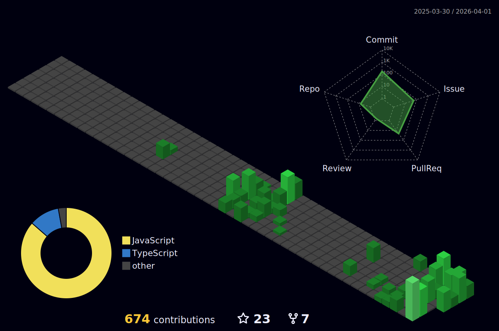

# Hi, I'm Philipp

## Contribution Snake

<picture>
  <source media="(prefers-color-scheme: dark)" srcset="https://raw.githubusercontent.com/PhilflowIO/PhilflowIO/output/github-snake-dark.svg" />
  <source media="(prefers-color-scheme: light)" srcset="https://raw.githubusercontent.com/PhilflowIO/PhilflowIO/output/github-snake.svg" />
  
</picture>

## 3D Contribution Graph

## GitHub Metrics

## Activity & Contributions

## Streaks

## Activity Graph

